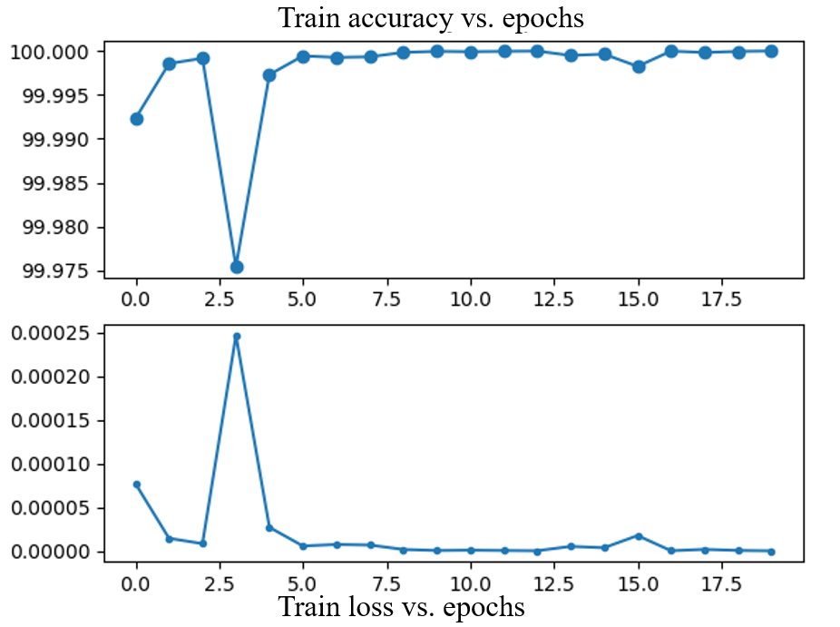

# CVbyDLproject
## Introduction to project
The goal of this reproduction project is to reproduce some results of the paper **'Measuring economic activity from space: a case study using flying airplanes and COVID-19'**. The interesting thing about the paper is the combination of computer vision on satellite imagery for a wide range of spatial areas. The paper basically aims at producing a flying airplane detector for satellite imagery and uses this data to produce time series data of airport activity. The airport activity is, according to the authors, an indicator for economic activity. It is interesting to work with satellite image data as it holds a lot of potential for computer vision projects.

Another interesting aspect of the project is the use of a relatively small amount of annotated images. The authors chose this approach as it makes the overall method suitable for a fast implementation for projects where large annotated datasets do not exist. Although there is a small amount of annotated data, the overall amount of data is huge. This is due to the large file sizes produced by the satellite imaging systems. For us it will be a challenge dealing with these large datasets, therefore we are considering using only a portion of the testing and validation data as the paper uses.

### Goal

The goal of the reproduction project is to recreate the model that can detect airplanes in the satellite aerial images. To be more specific, we want to compare the detection results of our trained model with the available author's trained model and plot the amount of detections for a specific dataset over time. It will be interesting to see how the reproduced model will perform as it will be trained using less data. In order to evaluate the performance of our model compared to the original model, we will create a timeseries plot based on the detections performed by each model. The line plot will show the #airplanes counted per time interval (day or month). Making a plot using both model detections as input, will allow us to evaluate if our model detects more or less airplanes than the original model.

## Dataset
The model is used to detect airplanes in satellite images. The paper used Sentinel-2 images of 30 airports from 2015 to 2020. The author used the images of 15 airports from January to July 2020 to train the model and test the model with a whole dataset.

In our case, we just use 2 airports data from 2020 to train our model and test our data.

First, we can see one of the images using this code:

```python
 path_images = './images/'
 path_annotations = './annotations/'

 files = []
 airports = sorted(os.listdir(path_annotations)) 
 print(airports) 
 for airport in airports:
 	fs = [f for f in sorted(os.listdir(os.path.join(path_annotations, airport))) if re.match(r'\d\d\d\d-\d\d-\d\d-\d\d-\d\d-\d\d\.txt', f)]
 	files += [(os.path.join(path_images, airport, f.replace('.txt', '_image.png')), os.path.join(path_annotations, airport, f)) for f in fs]

 print(files[0]) #： ('./images/DUB\\2020-01-03-11-36-21_image.png', './annotations/DUB\\2020-01-03-11-36-21.txt')

 img = cv2.imread(files[1][0], cv2.IMREAD_COLOR)
 print(img.shape[0]) #7791
 print(img.shape[1]) #6965
 cv2.imshow('image_org',img)
 cv2.waitKey(0)
```

Using these codes, we can get the image size 7791 x 6965 and the image is from DUB in 2020-01-03-11-36-21 will be shown to us.

<p align="center">

</p>

The color of this picture may look strange, because this picture is displayed by opencv in the order of the BGR channel. What we also need to do is to change the channel order and the image will appear in its original appearance.
```python
 img = cv2.imread(files[1][0], cv2.IMREAD_COLOR)[:, :, ::-1]/255.0 
 print(img.shape[0]) #7791
 print(img.shape[1]) #6965
 cv2.imshow('image_org',img)
 cv2.waitKey(0)
```
<p align="center">

</p>

## Sampling strategy
The sampling strategy for training will be explained here. The sampling strategy is the exact same as the one used by and taken from the authors. An important step of this strategy will be highlighted below, after which we will describe what it does.

```python
# crop samples from input image
			size = 25
			step = 3
			for cc in ann_list:
				for x in range(-1, 2):
					for y in range(-1, 2):
						# positive samples
						c = (cc[0]+y*step, cc[1]+x*step)
						if c[0]-size >= 0 and c[0]+size < img.shape[0] and c[1]-size >= 0 and c[1]+size < img.shape[1]:
							positives.append(img[c[0]-size:c[0]+size+1, c[1]-size:c[1]+size+1].copy())
						# negative samples
						if x != 0 or y != 0:
							c = (cc[0]+y*size, cc[1]+x*size)
							if c[0]-size >= 0 and c[0]+size < img.shape[0] and c[1]-size >= 0 and c[1]+size < img.shape[1]:
								negatives.append(img[c[0]-size:c[0]+size+1, c[1]-size:c[1]+size+1].copy())

			# extra negative samples sampled randomly over the entire image
			while len(negatives) < 2*len(positives):
				c = (np.random.randint(img.shape[0]), np.random.randint(img.shape[1]))
				if c[0]-size >= 0 and c[0]+size < img.shape[0] and c[1]-size >= 0 and c[1]+size < img.shape[1]:
					flag = True
					for cc in ann_list:
						if abs(cc[0]-c[0]) <= size or abs(cc[1]-c[1]) <= size:
							flag = False
							break
					# discard if sampled point is too close to an annotated point or if it falls in a blank image region
					if flag and np.sum(img[c[0]-size:c[0]+size+1, c[1]-size:c[1]+size+1]) > 0:
						negatives.append(img[c[0]-size:c[0]+size+1, c[1]-size:c[1]+size+1].copy())
```
First, a list with annotations with the locations of the airplanes is loaded (ann_list in code). Per airplane location, a positive sample will be taken around the airplane (blue box in image), and 8 more positive samples will be taken around/overlapping with the first location (green boxes in image) by shifting 3 pixels in x, y or both directions. There are 8 more red boxes will be used as a negative sample. They are taken around the target by shifting 25 pixels in x, y or botj directions. In order to maintain balance between the positive and negative samples, more randomly chosen negative patches will be selected as well.


Here we will also provide some examples of positive samples and nagetive samples.

positive examples:

<p align="center">

</p>

<p align="center">

</p>

<p align="center">

</p>
negative examples:

<p align="center">

</p>

<p align="center">

</p>

<p align="center">

</p>

## Training 
What the author described in the paper is that they use an FCN network to train the model. But according to the content of the paper, we found that the author did not use the exact FCN. They just used the CNN feature extraction part of FCN to reduce the dimensionality of the patch of image to one dimension, and then classified the patch into two categories, whether it is positive or nagetive. Thus, compared with the traditional CNN network, this network does not have the fully connected layer behind, and does not have upsample part compared with FCN network.

```python
class CONV_RELU_BN_POOL(nn.Module):
	def __init__(self, in_channels, out_channels, kernel_size=(5, 5), stride=(1, 1), pool_size=(5, 5), pool_stride=(1, 1)):
		super(CONV_RELU_BN_POOL, self).__init__()
		self.conv = nn.Conv2d(in_channels, out_channels, kernel_size=kernel_size, stride=stride, bias=False)
		self.relu = nn.ReLU()
		self.bn = nn.BatchNorm2d(out_channels)
		self.pool = nn.MaxPool2d(kernel_size=pool_size, stride=pool_stride)

	def forward(self, x):
		x = self.conv(x)
		x = self.relu(x)
		x = self.bn(x)
		x = self.pool(x)
		return x

class FCN(nn.Module):
	def __init__(self):
		super(FCN, self).__init__()
		self.conv1 = CONV_RELU_BN_POOL(in_channels=3, out_channels=16)
		self.conv2 = CONV_RELU_BN_POOL(in_channels=16, out_channels=32)
		self.conv3 = CONV_RELU_BN_POOL(in_channels=32, out_channels=64)
		self.conv4 = CONV_RELU_BN_POOL(in_channels=64, out_channels=64)
		self.conv5 = CONV_RELU_BN_POOL(in_channels=64, out_channels=64)
		self.conv6 = nn.Conv2d(64, 1, kernel_size=(11, 11), stride=(1, 1))
		self.sigmoid = nn.Sigmoid()

	def forward(self, x):
		x = self.conv1(x)
		x = self.conv2(x)
		x = self.conv3(x)
		x = self.conv4(x)
		x = self.conv5(x)
		x = self.conv6(x)
		x = self.sigmoid(x)
		return x
```

In the training model part, considering that the data set is extremely large, we cannot use all the annotation files provided by the author to train all the pictures of 15 airports in 2020. So we only used 220 images from the two airports, DUB and FRA, in 2020 for training. The training epoch is 20 times.

The training codes is in the file train.py. And the training loss and accuracy can be seen as follow:

<p align="center">

</p>

## Testing

In this section, we will describe the test results of the earlier described model on unseen data. As we trained the model on data from airports DUB and FRA (year 2020), the other data is suitable for evaluating the performance. In order to evaluate our model, which is trained on significantly less data than the author's model, we will evaluate the Schiphol Amsterdam Airport dataset (AMS) for all available years. First, we will detect airplanes using our trained model, after which we will do the same using the author's trained model. Each run will create a log file containing detections. These log files can be converted into a timeseries file, which is suitable for making a plot of #detected airplanes over time. 

The following code is used for testing of the models:

```python 
import torch
import torch.nn as nn
import torch.optim as optim
import torch.nn.functional as F
from tqdm import tqdm
import numpy as np
import random
import json
import sys
import cv2
import os
import re

from network import FCN
from network import NMS

path_images = './images/'
output_folder = './logs/'

def detect_image(det_model, nms_model, img):
	block = 512
	radius = 25
	size = 51

	# compute mask of detection for satellite image in chunks of [block x block] pixels

	full_mask = np.zeros((img.shape[0], img.shape[1], 1), np.float32)
	with torch.no_grad():
		for y in range(0, img.shape[0], block-2*radius):
			if y+size > img.shape[0]:
				break
			for x in range(0, img.shape[1], block-2*radius):
				if x+size > img.shape[1]:
					break
				if np.sum(img[y:y+block,x:x+block]) == 0:
					continue
				img_crop = torch.from_numpy(np.transpose(img[y:y+block,x:x+block], (2,0,1))).float().unsqueeze(0).cuda()
				mask_crop = det_model(img_crop)
				full_mask[y+radius:min(y+block-radius,img.shape[0]-radius), x+radius:min(x+block-radius,img.shape[1]-radius)] = mask_crop[0, :, :, :].cpu().numpy().transpose((1,2,0))

	det_mask = torch.from_numpy(np.transpose(full_mask, (2,0,1))).float().unsqueeze(0).cuda()
	dets = nms_model(det_mask).cpu().numpy()[:,2:].tolist()

	return dets

det_model = FCN().cuda()
det_model.load_state_dict(torch.load('./model/flying.pytorch'))
det_model.eval()

nms_model = NMS().cuda()
nms_model.eval()

airports = sorted(os.listdir(path_images))
for airport in airports:
	files = [f for f in sorted(os.listdir(os.path.join(path_images, airport))) if re.match(r'\d\d\d\d-\d\d-\d\d-\d\d-\d\d-\d\d_image\.png', f)]

	log = {}
	for f in files:
		print(airport, f)

		# load satellite image
		img = cv2.imread(os.path.join(path_images, airport, f), cv2.IMREAD_COLOR)[:, :, ::-1]/255.0

		# detect airplanes
		detects = detect_image(det_model, nms_model, img)

		block_height = img.shape[0]//7 # 7791//7 = 1113
		block_width = img.shape[1]//7 # 6965//7 = 995
		## 49 blocks for one image
		timestamp = f.split('_')[0]

		valid = []
		flag = False

		for i in range(0,img.shape[0],block_height):
			for j in range(0,img.shape[1],block_width):
				if np.sum(img[i:i+block_height,j:j+block_width]) > 0:
					valid.append(0) # valid place
				else:
					valid.append(None) # cloud and blank ground

		for c in detects:
			pos = (c[0]//block_height)*7 + c[1]//block_width
			if valid[pos] is not None:
				valid[pos] += 1

		for i in range(49):
			if valid[i] is not None and valid[i] > 5:
				valid[i] = None

		if valid.count(None) < len(valid):
			log[timestamp] = valid

	json.dump(log, open(os.path.join(output_folder, airport+'.log'), 'w'))
```
After creating timeseries from the log files, the following plot can be made, in which the green line represents the author's model result, the blue line represents our reproduced model's result and the purple dashed line is created from the annotations and can be considered as ground truth.


## Conclusion

As can be seen, the reproduced model brings a different result compared to the original model. It is difficult to assess which model performs actually better in terms of accuracy, as there is only a ground truth readily available for a small subset of the data. 

For this particular dataset, the reproduced model seems to produce a more accurate result. However, more testing should be performed to actually confirm this. In general, we expect the author's model to be more accurate as it has been trained on a larger amount of data. However, this certainly does not have to be true. This project is mostly aimed at gaining experience with applying computer vision by deep learning techniques. Reproducing parts of this paper has been a interesting challenge, especially challening due to the large amount of data the author's used to create their results.
