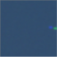

# CVbyDLproject
## Introduction to project
The goal of this reproduction project is to reproduce some results of the paper **'Measuring economic activity from space: a case study using flying airplanes and COVID-19'**. The interesting thing about the paper is the combination of computer vision on satellite imagery for a wide range of spatial areas. The paper basically aims at producing a flying airplane detector for satellite imagery and uses this data to produce time series data of airport activity. The airport activity is, according to the authors, an indicator for economic activity. It is interesting to work with satellite image data as it holds a lot of potential for computer vision projects.

Another interesting aspect of the project is the use of a relatively small amount of annotated images. The authors chose this approach as it makes the overall method suitable for a fast implementation for projects where large annotated datasets do not exist. Although there is a small amount of annotated data, the overall amount of data is huge. This is due to the large file sizes produced by the satellite imaging systems. For us it will be a challenge dealing with these large datasets, therefore we are considering using only a portion of the testing and validation data as the paper uses.

## Dataset
The model is used to detect airplanes in satellite images. The paper used Sentinel-2 images of 30 airports from 2015 to 2020. The author used the images of 15 airports from January to July 2020 to train the model and test the model with a whole dataset.

In our case, we just use 2 airports data from 2020 to train our model and test our data.

First, we can see one of the images using this code:

```python
 path_images = './images/'
 path_annotations = './annotations/'

 files = []
 airports = sorted(os.listdir(path_annotations)) 
 print(airports) 
 for airport in airports:
 	fs = [f for f in sorted(os.listdir(os.path.join(path_annotations, airport))) if re.match(r'\d\d\d\d-\d\d-\d\d-\d\d-\d\d-\d\d\.txt', f)]
 	files += [(os.path.join(path_images, airport, f.replace('.txt', '_image.png')), os.path.join(path_annotations, airport, f)) for f in fs]

 print(files[0]) #： ('./images/DUB\\2020-01-03-11-36-21_image.png', './annotations/DUB\\2020-01-03-11-36-21.txt')

 img = cv2.imread(files[1][0], cv2.IMREAD_COLOR)
 print(img.shape[0]) #7791
 print(img.shape[1]) #6965
 cv2.imshow('image_org',img)
 cv2.waitKey(0)
```

Using these codes, we can get the image size 7791 x 6965 and the image is from DUB in 2020-01-03-11-36-21 will be shown to us.

<p align="center">

</p>

The color of this picture may look strange, because this picture is displayed by opencv in the order of the BGR channel. What we also need to do is to change the channel order and the image will appear in its original appearance.
```python
 img = cv2.imread(files[1][0], cv2.IMREAD_COLOR)[:, :, ::-1]/255.0 
 print(img.shape[0]) #7791
 print(img.shape[1]) #6965
 cv2.imshow('image_org',img)
 cv2.waitKey(0)
```
<p align="center">

</p>

## Sampling strategy
The sampling strategy for training will be explained here. The sampling strategy is the exact same as the one used by and taken from the authors. An important step of this strategy will be highlighted below, after which we will describe what it does.

```python
# crop samples from input image
			size = 25
			step = 3
			for cc in ann_list:
				for x in range(-1, 2):
					for y in range(-1, 2):
						# positive samples
						c = (cc[0]+y*step, cc[1]+x*step)
						if c[0]-size >= 0 and c[0]+size < img.shape[0] and c[1]-size >= 0 and c[1]+size < img.shape[1]:
							positives.append(img[c[0]-size:c[0]+size+1, c[1]-size:c[1]+size+1].copy())
						# negative samples
						if x != 0 or y != 0:
							c = (cc[0]+y*size, cc[1]+x*size)
							if c[0]-size >= 0 and c[0]+size < img.shape[0] and c[1]-size >= 0 and c[1]+size < img.shape[1]:
								negatives.append(img[c[0]-size:c[0]+size+1, c[1]-size:c[1]+size+1].copy())

			# extra negative samples sampled randomly over the entire image
			while len(negatives) < 2*len(positives):
				c = (np.random.randint(img.shape[0]), np.random.randint(img.shape[1]))
				if c[0]-size >= 0 and c[0]+size < img.shape[0] and c[1]-size >= 0 and c[1]+size < img.shape[1]:
					flag = True
					for cc in ann_list:
						if abs(cc[0]-c[0]) <= size or abs(cc[1]-c[1]) <= size:
							flag = False
							break
					# discard if sampled point is too close to an annotated point or if it falls in a blank image region
					if flag and np.sum(img[c[0]-size:c[0]+size+1, c[1]-size:c[1]+size+1]) > 0:
						negatives.append(img[c[0]-size:c[0]+size+1, c[1]-size:c[1]+size+1].copy())
```
First, a list with annotations with the locations of the airplanes is loaded (ann_list in code). Per airplane location, a positive sample will be taken around the airplane (blue box in image), and 8 more positive samples will be taken around/overlapping with the first location (green boxes in image) by shifting 3 pixels in x, y or both directions. There are 8 more red boxes will be used as a negative sample. They are taken around the target by shifting 25 pixels in x, y or botj directions. In order to maintain balance between the positive and negative samples, more randomly chosen negative patches will be selected as well.


Here we will also provide some examples of positive samples and nagetive samples.

positive examples:

<p align="center">

</p>

<p align="center">

</p>

<p align="center">

</p>
negative examples:

<p align="center">

</p>

<p align="center">

</p>

<p align="center">

</p>
